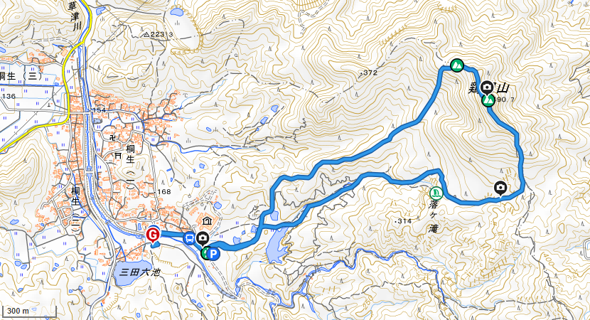

#### 更新履歴
- [x] v1.1 日程決定前
- [x] v1.2 軽微な修正、web最適化
- [x] v1.3 web最適化
- [ ] v1.4 最終版計画書(次回予定)

---
## 計画書
### 趣旨・目的

- [5回連続計画](https://finaldonguri.github.io/web_pentad/)の1回目
- ケガやトラブルなく山を楽しみ、ゴールすること
- ログをつけてGPXデータを取得し、振り返る

短いながらも鎖場・渡渉・ガレ場など野趣にあふれる明るいコースで山に慣れ、体幹安定性・全身協調性を確認する。

| 項目     | 内容                 |
| :------- | :------------------- |
| 場所     | 滋賀県草津市/栗東市  |
| 概要     | 夏の低山、川遊びつき |
| 歩行距離 | >>>>>> 中 (約6km)    |
| 高低差   | >>>> 小 (約350m)     |
| 予定時期 | 8月～9月、日帰り     |

#### 位置づけ

下記の5回連続計画の1回目

|      | #    | 山名               | 目標           |
| :--- | :--- | :----------------- | :------------- |
| ★    | 1    | 鶏冠山             | 小手調べ       |
|      | 2    | 武奈ヶ岳 or 蓬莱山 | 本格夏山       |
|      | 3    | 道迷いの森         | 読図訓練       |
|      | 4    | 高見山             | 浅い積雪       |
|      | 5    | 稲村ヶ岳           | 初心者向け雪山 |

### 参加者・連絡先

| 役割                | 名前     | 連絡先           |
| :------------------ | :------- | :--------------- |
| ガイド              | member01 | Discord → ****** |
| メンバー            | member02 |                  |
| (あと2名程度参加OK) |          |                  |

### 行動計画

| 時刻  | アクション/ウェイポイント          |
| :---- | :--------------------------------- |
| 09:30 | ***駅集合、出発(車移動)            |
| 10:30 | 上桐生登山口到着、登山出発         |
| 11:30 | 鶏冠山山頂到着、昼食               |
| 12:30 | 鶏冠山山頂出発                     |
| 13:30 | 上桐生登山口到着、帰路出発(車移動) |
| 14:30 | ***駅到着、解散                    |

#### 地域概念図

[国土地理院地形図(クリックで開きます)](https://maps.gsi.go.jp/#15/34.977232/136.007609/&base=std&ls=std&disp=1&vs=c1g1j0h0k0l0u0t0z0r0s0m0f1)

[ルート(クリックで開きます)](https://yamap.com/activities/37809190)

### 食糧計画

| 食事   | 献立                                     | 材料 | 調理方法           |
| :----- | :--------------------------------------- | :--- | :----------------- |
| 行動食 | 飴、塩など                               | N/A  | N/A                |
| 昼食   | コンビニ飯(パン、おにぎり、カップ麺など) | RM   | 湯沸かし(カップ麺) |

熱中症・痙攣予防に塩分、ミネラル分を積極的に補給する。

### 医療計画
下記物品をファーストエイドボックス1個に入れる。

| 名称                   | 員数 | 1回量 | 有効成分                                    | 使い方                                                                         |
| :--------------------- | :--- | :---- | :------------------------------------------ | :----------------------------------------------------------------------------- |
| ムヒアルファSII        | 1    | 適量  | ｼﾞﾌｪﾝﾋﾄﾞﾗﾐﾝ塩酸塩,ﾃﾞｷｻﾒﾀｿﾞﾝ酢酸ｴｽﾃﾙ             | 虫さされのかゆみ・痛み・腫れをおさえる                                         |
| 新フジアロー           | 1    | 適量  | ｺﾙﾁｿﾞﾝ酢酸ｴｽﾃﾙ,ｸﾛﾙﾌｪﾆﾗﾐﾝﾏﾚｲﾝ酸塩,ｼﾞﾌﾞｶｲﾝ塩酸塩 | 副腎皮質ホルモン(ステロイド)と麻酔剤。強いかゆみを抑える                       | 副腎皮質ホルモン(ステロイド)。強いかゆみを抑える |
| アンテベート           | 1    | 適量  | ﾍﾞﾀﾒﾀｿﾞﾝ酪酸ｴｽﾃﾙﾌﾟﾛﾋﾟｵﾝ酸ｴｽﾃﾙ                   |
| クロマイ-N             | 1    | 適量  | ｸﾛﾗﾑﾌｪﾆｺｰﾙ,ﾌﾗｼﾞｵﾏｲｼﾝ硫酸塩                   | 細菌の繁殖をおさえ、化膿・とびひ・毛嚢炎、面疔を治す                           |
| テラ・コートリル       | 1    | 適量  | ｵｷｼﾃﾄﾗｻｲｸﾘﾝ塩酸塩,ﾋﾄﾞﾛｺﾙﾁｿﾞﾝ                  | 副腎皮質ホルモン(ステロイド)と抗菌剤。化膿しているあせもやかぶれ、虫刺されなど |
| 液体絆創膏(コロスキン) | 1    | 適量  | ピロキシリン                                | 擦り傷・切り傷の消毒・止血・化膿予防                                           |
| カロナール             | 4    | 1～2  | ｱｾﾄｱﾐﾉﾌｪﾝ                                   | あらゆる痛みをやわらげる。(子供もOK)                                           |
| ロキソニン             | 2    | 1     | ﾛｷｿﾌﾟﾛﾌｪﾝﾅﾄﾘｳﾑ                               | あらゆる痛みをやわらげる(大人だけ)                                             |
| 葛根湯                 | 4    | 1     | 葛根湯                                      | 風邪のひきはじめを吹き飛ばす。飲んだら寝ること(大人だけ)                       |
| 恵命我神散             | 1    | 1     | ガジュツ                                    | 胃の気持ち悪いのをやわらげる(子供は半分の量)                                   |
| ペラック               | 6    | 2     | ﾄﾗﾈｷｻﾑ酸                                    | 口やのどの痛み、はれなどの症状をやわらげる(7歳から)                            |
| ディレグラ             | 2    | 1     | ﾌｪｷｿﾌｪﾅｼﾞﾝ塩酸塩,塩酸ﾌﾟｿｲﾄﾞｴﾌｪﾄﾞﾘﾝ              | アレルギーによる花粉症や、じんましんをやわらげる                               |
| 消毒液                 | 1    | 適量  | ベンゼトニウム,アラントイン                 |                                                                                |
| ガーゼ                 | 1    | 適量  |                                             |                                                                                |
| サージカルテープ       | 1    |       |                                             |                                                                                |
| はさみ                 | 1    |       |                                             |                                                                                |
| ピンセット             | 1    |       |                                             |                                                                                |
| つめきり               | 1    |       |                                             |                                                                                |
| 綿棒                   | 5    |       |                                             |                                                                                |
| 絆創膏(ケアリーヴS)    | 10   |       |                                             |                                                                                |
| 絆創膏(ケアリーヴM)    | 10   |       |                                             |                                                                                |
| スピール膏             | 5    | 1     | サリチル酸                                  | 皮膚が固くなるイボやウオノメに使う                                             |
| サラテクト50           | 1    | 適量  | DEET                                        | マダニ・ヤマビル・ブユ・蚊の忌避剤                                             |

### 装備計画
チェックのないものを個人で用意してください。チェックの入ったものはこちらで人数分準備可能です。
- [ ] リュックサック
- [ ] 運動靴（底の厚いもの、防水性高いものを推奨。登山靴だと尚よい）
- [ ] 山着（ズボン、シャツ、厚めの靴下）
- [ ] 着替え（シャツ、靴下、下着など）
- [ ] 雨具（カッパ）上下
- [ ] タオル
- [ ] 行動食(お菓子、プロテインバー、塩分など)
- [ ] 昼食
- [ ] [水2L以上](https://www.yodobashi.com/product/100000001001864307/)（暑いので）
- [ ] 昼食（内容は**食糧計画**参照）
- [ ] サンダル（川で遊ぶなら）
- [ ] スマホ（[Geographica](https://geographica.biz/)をインストールし、山域地図の事前キャッシュを推奨）
- [ ] モバイルバッテリ＋ケーブル（必要なら）
- [x] 調理器具
- [x] ナイフ
- [x] 印刷した1/25,000 地形図
- [x] [コンパス](https://www.yodobashi.com/product/100000001001857090/)
- [x] ファーストエイドボックス（内容は**医療計画**参照）
  
### 気象
- 前日18時時点の当該地域（滋賀県(1)草津市・栗東市）の[天気予報](https://tenki.jp/forecast/6/28/6010/25206/)で降水確率**60%以上**であれば、中止または延期する。
- **装備計画**のとおり、降雨に備え、雨具（カッパ）上下、タオルを各自持参する。
- 行動中、周辺に積乱雲の顕著な発達を確認した場合は、[当該地域の雨雲レーダー](https://tenki.jp/radar/6/28/)などから降水帯の距離・移動方向及び速度を推定してパーティーが落雷・降雨・川の増水などの影響を受ける可能性を評価し、雨具着用や予定変更、ビバークなど適切な行動をとる。

### 記録体制
- スマホアプリ([Runkeeper](https://runkeeper.com/ja/)など)にて、GPXログを取得する。対象は上桐生登山口出発後、同地点帰着まで。昼食時などは測定停止可。
- 写真・動画撮影は自由に行う。

### その他
- [滋賀県熊出没マップ](https://www.google.com/maps/d/u/0/viewer?mid=1rE5HcSdJnm2gX3iT1FMt0aCVuQ9ArDs&ll=34.98091430000003%2C135.98476090000003&z=12)
- [クマ出没情報ブログ(滋賀県)](http://sukeroku.blog55.fc2.com/blog-category-52.html)

---
## 報告書

### 参加者
### 行動記録
#### GPXファイル
#### 振り返り
#### アルバム
---
[EOF]

